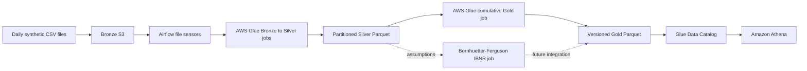

# Auto Insurance Lakehouse Pipeline

An end-to-end data engineering project for synthetic auto-insurance analytics. The pipeline loads four daily operational datasets into Amazon S3, transforms them with AWS Glue, orchestrates processing with Apache Airflow, and publishes policy and portfolio profitability tables that can be queried in Amazon Athena.

All policy, claim, payment, exposure, and expense records in this project are synthetic.

## Architecture



The Airflow DAG processes one `process_date` per run. Its four Silver branches run independently after their corresponding Bronze files arrive. Gold begins only when all four branches succeed. For a historical backfill, dates are submitted sequentially so each Gold result represents the cumulative period from `2026-01-01` through that run's process date.

## Datasets

| Dataset | Grain | Purpose |
|---|---|---|
| `claims_events` | Claim source event/version | Claim inserts and updates, reported incurred and paid balances |
| `daily_exposure` | Policy-day | Earned exposure and earned premium denominators |
| `claim_payments` | Payment transaction | Claim cash-payment ledger and paid-loss reconciliation |
| `expense_transactions` | Expense transaction | Direct claim/policy costs and unallocated portfolio/corporate costs |

Expenses with `CLAIM` or `POLICY` scope may be associated with a policy. `PORTFOLIO` and `CORPORATE` expenses remain at aggregate level and are not arbitrarily allocated to clients.

## Processing layers

### Bronze

Bronze contains date-addressable CSV objects such as:

```text
s3://bronze-auto-insurance/claims-events/claim_events_2026-01-10.csv
s3://bronze-auto-insurance/daily-exposure/daily_exposure_2026-01-10.csv
s3://bronze-auto-insurance/claim-payments/claim_payments_2026-01-10.csv
s3://bronze-auto-insurance/expense-transactions/expense_transactions_2026-01-10.csv
```

### Silver

The Glue jobs validate fields, standardize types, quarantine invalid records, deduplicate within a load date, and overwrite only the requested partition:

```text
s3://silver-auto-insurance/<dataset>/load_date=YYYY-MM-DD/
s3://silver-auto-insurance/quarantine/<dataset>/load_date=YYYY-MM-DD/
```

### Gold

The cumulative Gold job resolves the latest claim version, reconciles payments, separates direct costs from overhead, and publishes immutable output generations. Glue Catalog partitions point consumers to the successful generation for each `as_of_date`.

| Gold table | Grain |
|---|---|
| `claim_snapshot` | Latest economic version of each claim |
| `policy_performance` | Policy profitability and underwriting measures |
| `portfolio_performance` | Portfolio-wide premium, loss, expense, and combined ratios |
| `expense_summary` | Expense scope/category/region summary |

Paid cash is a reconciliation measure. It is not deducted again from profitability because reported incurred loss already contains paid loss plus case outstanding.

## Verified outcome through January 10, 2026

The daily Airflow/Glue backfill completed successfully for every date from January 1 through January 10. Athena returned the following synthetic portfolio result for `as_of_date='2026-01-10'`:

| Metric | Result |
|---|---:|
| Policies | 10,000 |
| Earned exposure | 269.57966240 policy-years |
| Earned premium | $337,256.18 |
| Reported claims | 49 |
| Reported incurred loss | $554,712.31 |
| Claim-payment ledger | $5,424.14 |
| Direct expense | $25,462.84 |
| Portfolio expense | $7,500.00 |
| Corporate expense | $1,800.00 |
| Total expense | $34,762.84 |
| Reported result before IBNR | -$252,218.97 |
| Reported loss ratio | 164.48% |
| Expense ratio | 10.31% |
| Reported combined ratio | 174.79% |
| Unreconciled claims | 0 |

Gold row counts for that valuation were 49 claim snapshots, 10,000 policy rows, one portfolio row, and 17 expense-summary rows. These values describe synthetic data over a short and immature reporting period; they are pipeline demonstration results rather than actuarial benchmarks.

## Repository layout

```text
Scripts/
  bronze_to_silver_claim_events.py
  bronze_to_silver_daily_exposure.py
  bronze_to_silver_claim_payments.py
  bronze_to_silver_expense_transactions.py
  silver_to_gold_auto_insurance.py
  silver_to_gold_ibnr_bf.py
airflow/
  dags/auto_insurance_bronze_to_silver.py
  Dockerfile
  docker-compose.yaml
  .env.example
docs/
  experiments.md
examples/
  policy_changes/
  schema_evolution/
sql/
  gold_queries.sql
```

Generated raw files, Airflow logs/configuration, Python caches, and the real `.env` file are intentionally excluded from Git. The complete generated dataset remains in local storage and S3. This keeps credentials and machine-generated data out of source control while preserving all code required to explain and reproduce the pipeline.

## Local Airflow setup

Requirements:

- Docker Desktop
- AWS credentials configured in `~/.aws`
- Access to the project S3 buckets and Glue jobs

Create the local environment file:

```bash
cd airflow
cp .env.example .env
```

Replace the placeholder Fernet key, build the local image if needed, and start Airflow:

```bash
docker compose build
docker compose up airflow-init
docker compose up -d
```

The Airflow interface is available at `http://localhost:8080`.

Trigger one date:

```bash
docker compose exec -T airflow-scheduler \
  airflow dags trigger auto_insurance_bronze_to_silver \
  --run-id manual_2026-01-10 \
  --conf '{"process_date":"2026-01-10"}'
```

The DAG uses `schedule=None`, so it runs only when triggered. Historical dates are not discovered automatically. A scheduler or backfill launcher must explicitly create each date's run.

## Athena

Example analysis queries are in [`sql/gold_queries.sql`](sql/gold_queries.sql). Always filter Gold tables to exactly one `as_of_date`; summing multiple cumulative snapshots would double-count results.

## Planned demonstrations

The next experiments are defined in [`docs/experiments.md`](docs/experiments.md):

1. Apply an effective-dated policy update without rewriting history.
2. Introduce a new claim-payment column and demonstrate both a controlled schema failure and a backward-compatible migration.
3. Run the Bornhuetter-Ferguson IBNR model with reviewed assumptions and reconcile it to the reported Gold result.

The IBNR job is deliberately separate from the production Gold DAG until its expected loss ratio and development pattern are reviewed. It estimates broad incurred-but-not-reported development, including IBNER, by accident month. It does not allocate IBNR to individual policies.
